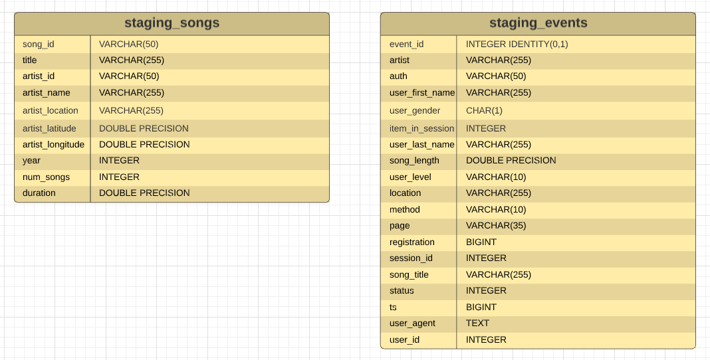
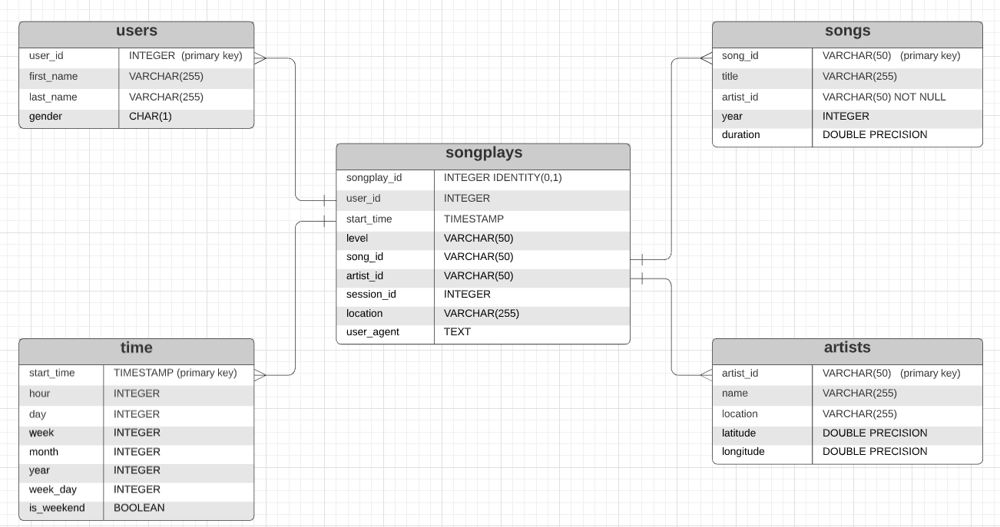

# Data WareHouse Project   
Song Play Analysis with S3 and Redshift

## Introduction
A music streaming startup, Sparkify, has grown their user base and song database and want to move their processes and data onto the cloud. Their data resides in S3, in a directory of JSON logs on user activity on the app, as well as a directory with JSON metadata on the songs in their app.     
As their data engineer, we got task to build an ETL pipeline that extracts their data from S3, stages them in Redshift, and transforms data into a set of dimensional tables for their analytics team to continue finding insights in what songs their users are listening to.   

## Datasets
Datasets used in this project is provided in two public **S3 buckets**. One bucket contains info about songs and artists, the second bucket has info concerning actions done by users (which song are listening, etc.. ). The objects contained in both buckets 
are in *JSON* files. 

## Postgres Data Models / Table Schema / Star Schema

### Staging Tables

### Dimensional Star Schema For Analytics team

## Data Warehouse Configurations and Setup
* Create a new `IAM user` in your AWS account
* Give it AdministratorAccess and Attach policies
* Use access key and secret key to create clients for `EC2`, `S3`, `IAM`, and `Redshift`.
* Create an `IAM Role` that makes `Redshift` able to access `S3 bucket` (ReadOnly)
* Create a `RedShift Cluster` and get the `DWH_ENDPOIN(Host address)` and `DWH_ROLE_ARN` and fill the config file.

### ETL Pipeline
+ Created tables to store the data from `S3 buckets`.
+ Loading the data from `S3 buckets` to staging tables in the `Redshift Cluster`.
+ Inserted data into fact and dimension tables from the staging tables.

### Project Structure

+ `create_tables.py` - This script will drop old tables (if exist) ad re-create new tables.
+ `etl.py` - This script executes the queries that extract `JSON` data from the `S3 bucket` and ingest them to `Redshift`.
+ `sql_queries.py` - This file contains variables with SQL statement in String formats, partitioned by `CREATE`, `DROP`, `COPY` and `INSERT` statement.
+ `dhw.cfg` - Configuration file used that contains info about `Redshift`, `IAM` and `S3`

### How to Run
1. Create tables by running `create_tables.py`.
2. Execute ETL process by running `etl.py`.

